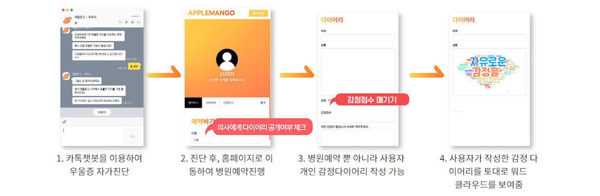
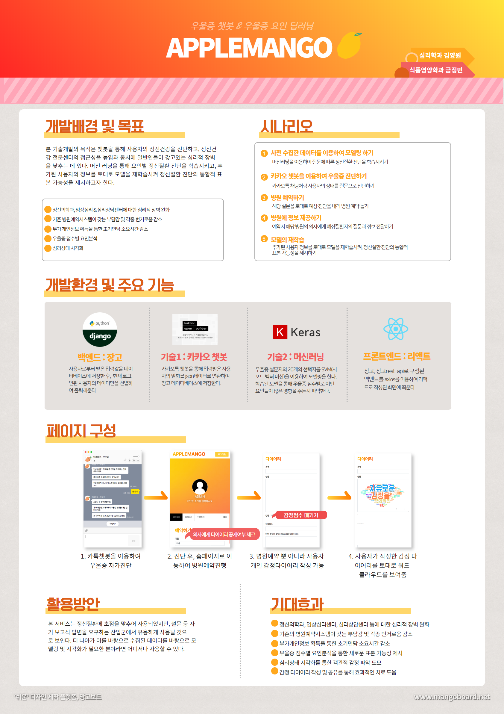

# 딥러닝을 통해 요인별 정신질환 진단 
[2020년 충남대 주니어 창의 경진 대회 우수상]
딥러닝을 통해 요인별 정신질환 진단 

```
팀명 : 애플망고

팀원 : adelakim5, KumJungMin

역할 : adelakim5(챗봇, 워드클라우드), KumJungMin(프론트기획 및 개발, 머신러닝)
```
## 0. 개발환경
  django
  
  djangorestframework
  
  html


## 1. 설명
  ### 1) 기술개발목표
  
  ○정신의학과, 임상심리센터, 심리상담센터 등에 대한 심리적 장벽 완화 
  
  ○기존의 병원예약시스템이 갖는 부담감 및 각종 번거로움 감소 
  
  ○부가개인정보 획득을 통한 초기면담 소요시간 감소
  
  ○우울증 점수별 요인분석
  
  ○심리상태 시각화
  
  
  ### 2) 기술개발의 목적 및 중요성
  : 본 기술개발의 목적은 챗봇을 통해 사용자의 정신건강을 진단하고, 정신건강 전 문센터의 접근성을 높임과 동시에 일반인들이 갖고 있는 심리적 장벽을 낮추는 데 있다. 
  머신러닝을 통해 요인별 정신질환 진단을 학습시키고, 추가된 사용자의 정보를 토대로 모델을 재학습시켜 정신질환 진단의 통합적 표본 가능성을 제시 하고자 한다.

  ### 3) 활용방안 및 기대효과 
  : 본 서비스는 정신질환에 초점을 맞추어 사용되었지만, 설문 등 자기 보고식 답 변을 요구하는 산업군에서 유용하게 사용될 것으로 보인다. 더 나아가 이를 바 탕으로 수집된 데이터를 바탕으로 모델링 및 시각화가 필요한 분야라면 어디서 나 사용할 수 있다.

  ○정신의학과, 임상심리센터, 심리상담센터 등에 대한 심리적 장벽 완화 ○기존의 병원예약시스템이 갖는 부담감 및 각종 번거로움 감소 
  
  ○부가개인정보 획득을 통한 초기면담 소요시간 감소
  
  ○우울증 점수별 요인분석을 통한 새로운 표본 가능성 제시
  
  ○감정 다이어리 작성 및 공유를 통해 효과적인 치료 도움 ○심리상태 시각화를 통한 객관적 감정 파악 도모


## 2. 프론트 시나리오



## 3. 포스터


## 4. 시연 영상
[](https://www.youtube.com/watch?v=9bhmhXvmM9A)
